  

  <b>2024 PICT-FEST Winner - "Best Project" Nomination</b>

# Welcome to the **Overheat Project** 🔥

## What is Overheat? 🚀

Overheat is an award-winning project that combines computer vision, embedded systems, and network analysis to create **affordable 3D WiFi coverage heatmaps**. We're solving a real problem in a creative way - professional WiFi mapping tools cost over $5,000, while our solution brings the price point down to approximately $80!

### The Problem We're Solving

Imagine trying to optimize WiFi coverage in your office or home:
- Professional tools like NetAlly AIRCHECK-G3 cost over $5,000 (532,000₽)
- Consumer options (phone + speedtest apps) are inaccurate and tedious
- There's nothing in between... until now!

### Our Solution

We've built a compact hardware-software system that:
1. Maps physical spaces in 3D using ORB-SLAM3 and a monocular camera
2. Measures WiFi signal strength (RSSI) and connection speed at precise locations
3. Visualizes everything as an interactive 3D heatmap on your phone
4. Makes deployment and network planning decisions easy and data-driven

## Presentation Highlights

||
|-|

  <a href="https://github.com/user-attachments/files/19766214/EMB_PRJ.pdf">
    <b>👉 View Full Presentation</b>
  </a>

## Technology Stack 💻

- **Hardware**: Raspberry Pi 5, Arducam IMX219, custom 3D-printed case with active cooling
- **Computer Vision**: ORB-SLAM3 (Oriented FAST and Rotated BRIEF Simultaneous Localization and Mapping)
- **Software**: ROS2 Humble, Python for data processing, Matplotlib for visualization
- **Mobile App**: Kotlin/Android with Bluetooth connectivity and interactive 3D visualization
- **Networking**: Real-time WiFi strength mapping + speed testing via direct connection

## How It Works 🔍

### Raspberry Pi

```mermaid
stateDiagram-v2
    [*] --> Idle : Запуск системы


    Idle --> LoadingData : Получена команда на отправку
    LoadingData --> SendingData : Данные загружены из БД


    Idle --> CollectingData : Получена команда на сбор данных
    CollectingData --> SavingData

    state cmd_sel <<choice>>
    SavingData --> cmd_sel : Измерение сохранено в БД
    cmd_sel --> CollectingData : Нет команды
    cmd_sel --> SendingData : Команда окончания записи


    SendingData --> Idle : Данные отправлены
```

### Android phone

```mermaid
stateDiagram-v2
    [*] --> Idle : Запуск приложения

    Idle --> SendStart : Нажата кнопка записи
    SendStart --> Waiting
    Waiting --> Waiting
    Waiting --> SendStop : Нажата кнопка окончания
    SendStop --> ReceivingData
    ReceivingData --> BuildingMap : Получены данные
    BuildingMap --> SavingMap : Карта построена по данным
    SavingMap --> DrawingMap : Карта сохранена локально


    Idle --> LoadingMap : Выбрана построенная карта
    LoadingMap --> DrawingMap : Загружена построенная карта


    DrawingMap --> Idle
```

1. The system **captures video** from the monocular camera
2. ORB-SLAM3 processes the feed to **build a 3D map** of the environment in real-time
3. Simultaneously, the WiFi module **measures signal strength and speed** at each location
4. All data points are **geo-tagged** with precise 3D coordinates
5. The Android app **visualizes the heatmap** overlaid on the 3D model
6. Users can **interact with the visualization** to find dead zones and optimal router placements

> Want the technical details? Check out our [detailed architecture documentation](https://github.com/Overheat-project/overheat-docs/blob/master/ARCHITECTURE.md)

## Team 👨‍💻

- **Dvorkin Boris Alexandrovich** (@worthant): Lead Developer (Embedded, DevOps, Computer Vision, UI/UX)
- **Bardin Petr Alekseevich**: Embedded Developer, Computer Vision Specialist, Android App Developer
- **Kadilov Mikhail Vladimirovich**: 3D Modeling, Testing, UI/UX Design

## Project Status and Recognition 🏆

- ✅ **1st Place Winner** at PICT-FEST 2024, ITMO University's "Best Project" category
- ✅ **Full hardware prototype** completed with custom case design and thermal management
- ✅ **Core software components** developed and tested individually
- ✅ **Mobile app prototype** designed with Bluetooth connectivity

## Why It Matters 📊

Our technology can revolutionize how we plan and optimize WiFi networks in:
- **Office spaces**: Optimize access point placement and reduce equipment costs
- **Shopping malls & warehouses**: Ensure coverage in all critical areas
- **Homes**: Identify dead zones and improve router placement
- **Educational institutions**: Provide reliable coverage for modern learning environments

## Future Development Roadmap 🔮

- [ ] Optimize energy consumption for longer battery life
- [ ] Improve mapping accuracy with additional sensors (lidar? binocular camera? you can sponsor us..)
- [ ] Extend functionality to analyze other wireless networks (1-5G, Bluetooth)
- [ ] Add cloud synchronization for data storage and analysis
- [ ] Develop iOS version of the mobile application

## Get Involved 🤝

While our project is currently in research phase with limited public code access, we welcome:
- Technical discussions and feature suggestions
- Hardware optimization ideas
- Use case proposals
- Academic and industry collaboration opportunities

Feel free to reach out to our team for more information!

---

<i>Created with ❤️ at ITMO University, Saint Petersburg, Russia</i>

